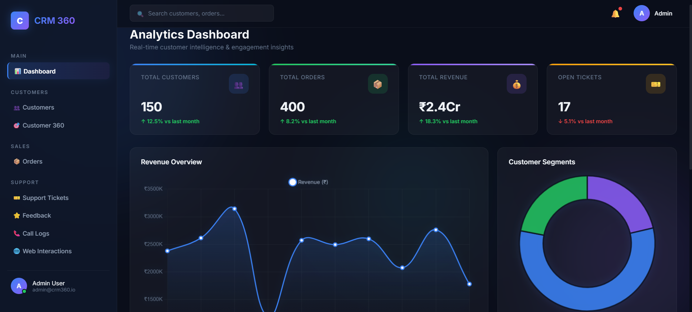
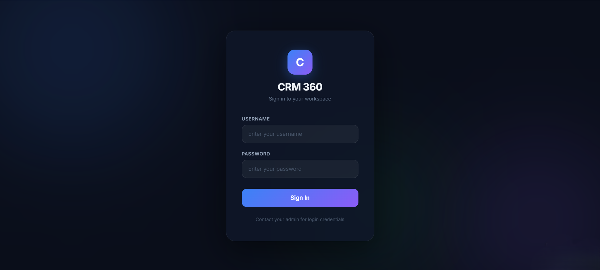
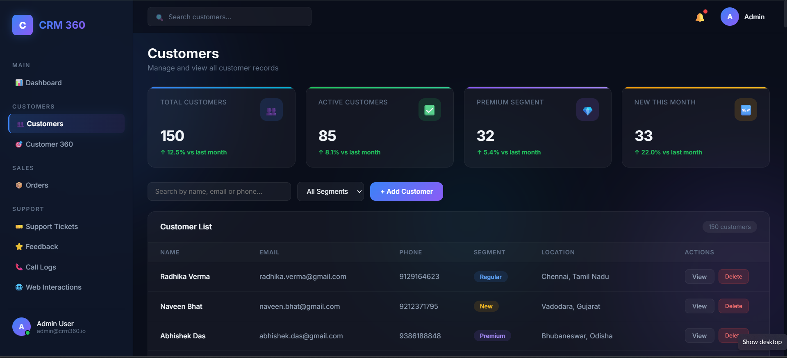
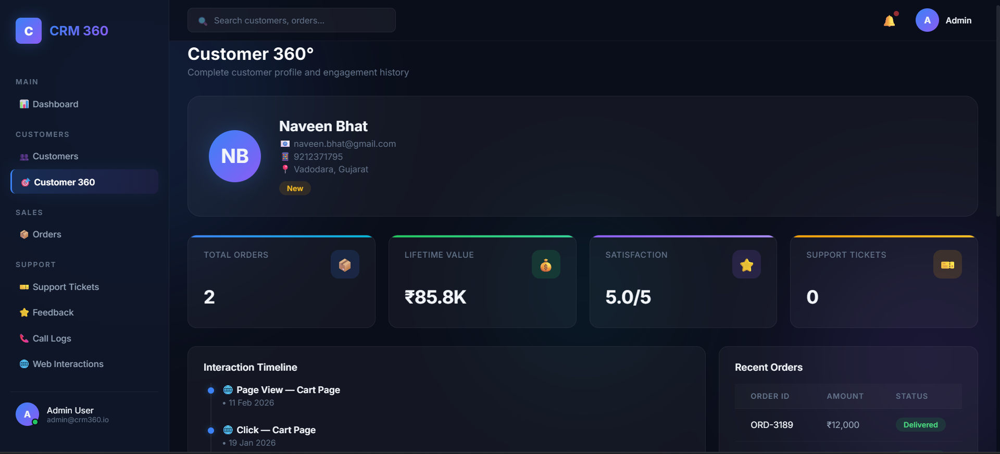
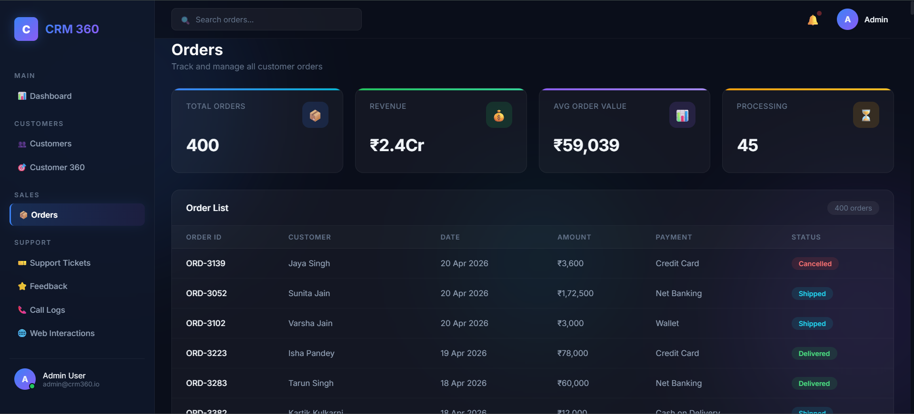
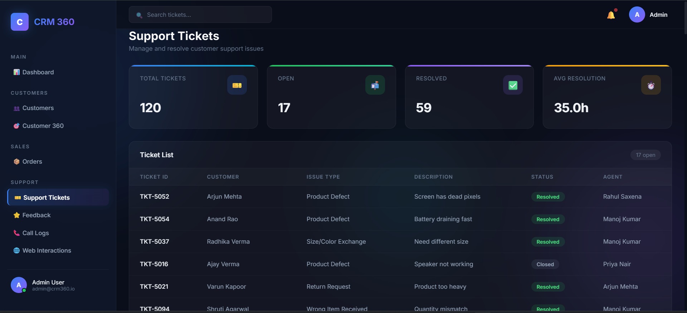
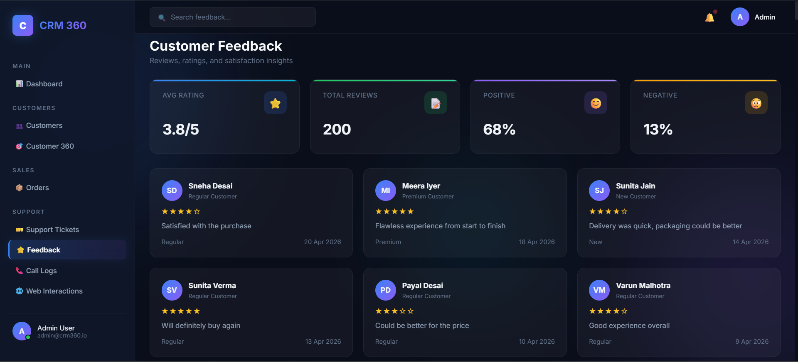
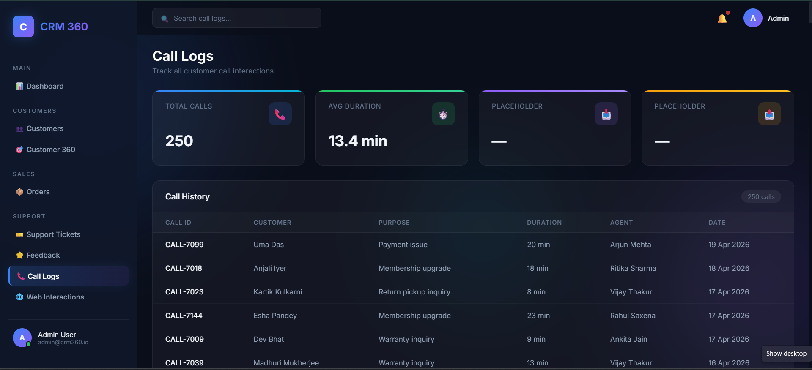
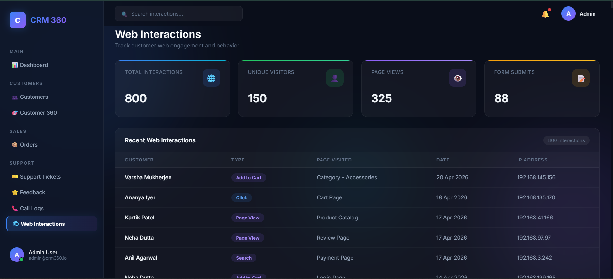

# CRM 360 — Customer Intelligence System

<p>


</p>

*A modern full-stack Customer Relationship Management (CRM) platform built using Flask, MySQL, JavaScript, and Chart.js.*

<p align="center">
  
</p>

**CRM 360** is a full-stack Customer Relationship Management (CRM) platform designed to help businesses track customer data, analyze sales KPIs, manage support tickets, and monitor web interactions in real time.

Built with a focus on modern UI/UX (Glassmorphism) and a robust backend architecture, this project serves as a complete, enterprise-level application demonstrating end-to-end full-stack development.

---

## 🚀 Key Features

- **Role-Based Authentication:** Secure login system differentiating between **Admin** (full access) and **Agent** (view-only) roles.
- **Dynamic Dashboard Analytics:** Real-time KPI aggregation (Total Revenue, Customer Growth, Pending Orders) powered by SQL.
- **Customer Management (CRUD):** Add new customers, view detailed 360° profiles (timelines, orders, tickets), update records, and delete customers.
- **Global Smart Search:** Instantly search across the entire database by customer name, phone number, or email.
- **Realistic Data Simulation:** Includes a Python database seeder that generates **1,900+ realistic records** across **10 normalized MySQL tables**.
- **Modern UI/UX:** Responsive dark-themed Glassmorphism interface with smooth animations and interactive Chart.js visualizations.

---

## 📸 Screenshots

<table>
<tr>
<td align="center" width="45%">

### 🔐 Login Page


</td>

<td width="5%"></td>

<td align="center" width="45%">

### 📊 Dashboard


</td>
</tr>

<tr>
<td align="center">

### 👥 Customer Management


</td>

<td></td>

<td align="center">

### 👤 Customer 360 Profile


</td>
</tr>

<tr>
<td align="center">

### 📦 Orders Management


</td>

<td></td>

<td align="center">

### 🎫 Support Tickets


</td>
</tr>

<tr>
<td align="center">

### ⭐ Customer Feedback


</td>

<td></td>

<td align="center">

### 📞 Call Logs


</td>
</tr>

<tr>
<td colspan="3" align="center">

### 🌐 Web Interactions
<br>


</td>
</tr>
</table>

---

## 🛠️ Technology Stack

### Frontend
- HTML5 & CSS3
- JavaScript (ES6+, Fetch API)
- Chart.js

### Backend
- Python 3
- Flask (REST API Server)
- Flask-CORS
- python-dotenv

### Database
- MySQL
- mysql-connector-python

---

## 🏗️ Architecture Overview

The system follows a classic Client-Server architecture:

1. **Client (Browser):** Vanilla JavaScript frontend making asynchronous `fetch()` API calls.
2. **Server (Flask):** Python backend exposing REST APIs and handling business logic.
3. **Database (MySQL):** Relational database storing customers, orders, support tickets, call logs, and other CRM data across 10 normalized tables.

---

## ⚙️ Local Setup Instructions

### 1. Prerequisites

- Python 3.10+
- MySQL Server & MySQL Workbench (or XAMPP)
- VS Code (with Live Server extension)

### 2. Database Setup

Create the database:

```sql
CREATE DATABASE crm360_db;
```

Run the SQL scripts provided in the `Database/` folder to create all required tables.

### 3. Backend Configuration

Install dependencies:

```bash
pip install -r requirements.txt
```

Create a `.env` file inside the `Backend/` folder:

```env
DB_HOST=localhost
DB_USER=root
DB_PASSWORD=your_mysql_password_here
DB_NAME=crm360_db
```

Generate users and sample data:

```bash
python create_users.py
python seed_data.py
```

Start the Flask server:

```bash
python app.py
```

The backend will run at:

```
http://localhost:5000
```

### 4. Frontend Launch

- Open the project in VS Code.
- Right-click `Frontend/login.html`.
- Select **Open with Live Server**.

Login using:

**Username:** `admin`

**Password:** `admin123`

---

## 🚀 Future Enhancements

- JWT-based authentication
- Email notifications for support tickets
- Export reports to PDF and Excel
- Docker containerization
- Cloud database deployment
- AI-powered customer insights and recommendations

---

## 📝 License

This project was built for educational and portfolio demonstration purposes. Feel free to fork, explore, and modify it for learning purposes.

---

## 👨‍💻 Author

**Saksham Tiwari**

Built as a full-stack portfolio project for learning and demonstrating backend development, database design, and frontend integration.
